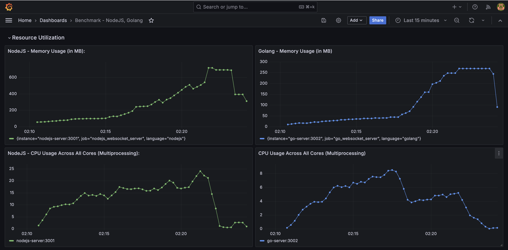
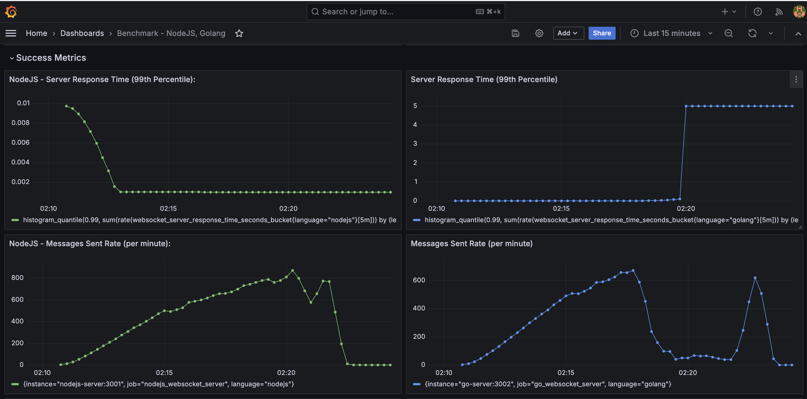
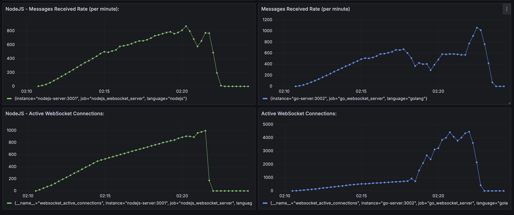
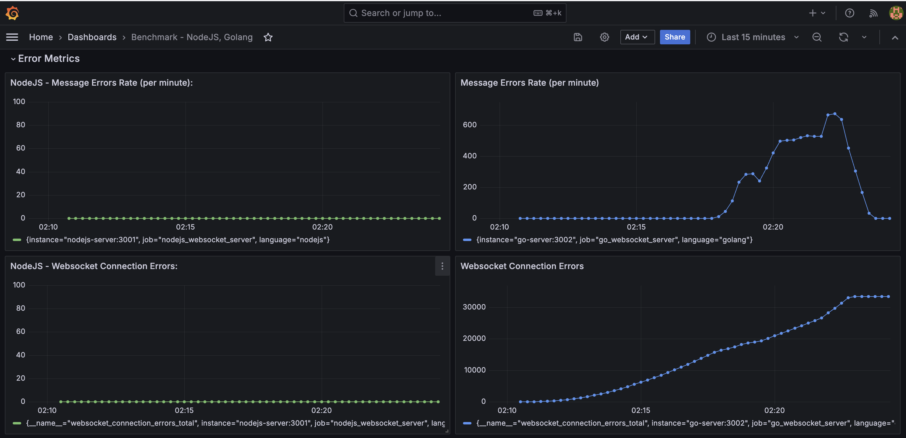

# Benchmarking WebSocket Servers with Node.js, Go, Protocol Buffers, Prometheus, Grafana, and K6 Load Testing

This setup includes WebSocket servers built with **Node.js** and **Go**, using **Protocol Buffers (Protobufs)** for message serialization. It incorporates **Prometheus** and **Grafana** for monitoring, and **K6** for load testing. The entire system is orchestrated using **Docker Compose**.

## Features

- **WebSocket Servers**: Real-time communication using WebSocket protocol, implemented in both Node.js and Go.
- **Prometheus Monitoring**: Custom metrics are collected and exposed for both WebSocket servers.
- **Grafana Dashboards**: Visualize performance metrics such as active WebSocket connections, message throughput, response times, and errors.
- **K6 Load Testing**: Simulate load on the WebSocket servers and analyze performance under stress.

## Services Overview

- **Node.js WebSocket Server**: A WebSocket server implemented using Node.js, exposing WebSocket and HTTP metrics.
- **Go WebSocket Server**: A WebSocket server implemented using Go, also exposing WebSocket and HTTP metrics.
- **Prometheus**: Used to scrape and store metrics from both WebSocket servers.
- **Grafana**: Provides an interface to visualize metrics from Prometheus.
- **K6**: A load testing tool to test the performance of both WebSocket servers.

## Prerequisites

- Docker and Docker Compose must be installed on your system.

## Usage

### 1. Clone the Repository

```bash
git clone https://github.com/AnuragJCChaturvedi/websocket-benchmark
cd websocket-benchmark
```

### 2. Configuration Files

Ensure the necessary configuration files are in place:

- `./monitoring/prometheus.yml`: The Prometheus configuration for scraping metrics.
- `./websocket-server/nodejs/Dockerfile`: The Dockerfile for building the Node.js WebSocket server.
- `./websocket-server/go/Dockerfile`: The Dockerfile for building the Go WebSocket server.
- `./client-k6/Dockerfile`: The Dockerfile for building the K6 load testing client.
- `shared.env`: Shared environment variables for the WebSocket servers (e.g., ports).

### 3. Build and Start the Services

Use Docker Compose to build and start the services:

```bash
docker-compose up --build
```

This will start the following services:

- **Prometheus**: Running on `http://localhost:9090`
- **Grafana**: Running on `http://localhost:3000` (default login is `admin:secret`)
- **Node.js WebSocket Server**: Exposed on `ws://localhost:3001`
- **Go WebSocket Server**: Exposed on `ws://localhost:3002`
- **K6 Load Testing**: Runs automatically after starting the WebSocket servers.

### 4. Access the Services

- **Prometheus**: Go to `http://localhost:9090` to view and query the metrics.
- **Grafana**: Go to `http://localhost:3000` (login with `admin:secret` by default) to visualize the metrics using Grafana dashboards.
- **Node.js WebSocket Server**: WebSocket server and HTTP API available on `ws://localhost:3001`.
- **Go WebSocket Server**: WebSocket server and HTTP API available on `ws://localhost:3002`.

### 5. Load Testing with K6

The K6 service simulates load testing for both the Node.js and Go WebSocket servers. After the K6 container finishes running, you can analyze the performance metrics in Prometheus and Grafana.

### 6. Stopping the Services

To stop the services, press `CTRL + C` in your terminal or run the following command:

```bash
docker-compose down
```

This stops and removes the containers, but the data in Prometheus and Grafana volumes will be retained.

## Prometheus Metrics

Each WebSocket server exposes its metrics at `/metrics`. Prometheus scrapes these metrics and stores them for visualization in Grafana. The following custom metrics are tracked:

- **`websocket_messages_received_total`**: Total number of WebSocket messages received.
- **`websocket_messages_sent_total`**: Total number of WebSocket messages sent.
- **`websocket_active_connections`**: Number of active WebSocket connections.
- **`websocket_server_response_time_seconds`**: Response time in seconds for WebSocket messages.
- **`websocket_connection_errors_total`**: Total number of WebSocket connection errors.
- **`websocket_message_errors_total`**: Total number of WebSocket message processing errors.

## Docker Compose Services

The `docker-compose.yml` defines the following services:

- **Prometheus**: A monitoring and alerting toolkit.
- **Grafana**: A visualization tool for metrics collected by Prometheus.
- **Node.js WebSocket Server**: A WebSocket server written in Node.js, exposing WebSocket communication and metrics.
- **Go WebSocket Server**: A WebSocket server written in Go, exposing WebSocket communication and metrics.
- **K6 Load Testing**: Used to test the performance of the WebSocket servers under load.

### Customizing Resources

The Docker Compose file includes resource limits (CPU and memory) for the Node.js, Go, and K6 services. You can adjust these limits in `docker-compose.yml` under the `deploy` section.

## Monitoring with Grafana

1. Once the stack is up and running, go to `http://localhost:3000`.
2. Log in with the default credentials (`admin:secret`).
3. Create a new dashboard or import existing ones to visualize WebSocket performance metrics.

## License

This project is licensed under the MIT License.

## Protocol Buffers (Protobuf)

This project uses **Protocol Buffers** (Protobuf) for efficient serialization of structured data in WebSocket communication. Protobuf is a language-neutral, platform-neutral, and extensible way to serialize structured data.

### Setup Protobuf

1. **Install Protobuf Compiler**: You need the Protobuf compiler (`protoc`) to compile `.proto` files to the desired language.

   - For macOS using Homebrew:
     ```bash
     brew install protobuf
     ```
   - For Ubuntu:
     ```bash
     sudo apt install protobuf-compiler
     ```
   - For Windows, download the precompiled binaries from [here](https://github.com/protocolbuffers/protobuf/releases).

2. **Define Your `.proto` Files**:
   Write your Protobuf message definitions in `.proto` files, e.g., `message.proto`.

   Example `message.proto` file:
   ```protobuf
   syntax = "proto3";

   message WebsocketMessage {
       string content = 1;
       string senderId = 2;
       string receiverId = 3;
   }
   ```

3. **Generate Code**:
   Use the Protobuf compiler to generate the language-specific bindings. For example, to generate JavaScript and Go bindings:

   - For **Node.js**:
     ```bash
     protoc --js_out=import_style=commonjs,binary:. ./message.proto
     ```

   - For **Go**:
     ```bash
     protoc --go_out=. ./message.proto
     ```

4. **Use Protobuf in Code**:
   In both the **Node.js** and **Go** WebSocket servers, Protobuf messages are used to encode/decode binary messages transmitted over WebSocket.

   Example usage in Node.js:
   ```javascript
   const messages = require('./protobuf/message_pb');
   const receivedMessage = messages.WebsocketMessage.deserializeBinary(msg);
   ```

   Example usage in Go:
   ```go
   import pb "Go/protobuf" // Import the generated Protobuf package
   receivedMessage := &pb.WebsocketMessage{}
   err := proto.Unmarshal(msg, receivedMessage)
   ```

5. **Send and Receive Protobuf Messages**:
   Protobuf messages are sent and received as binary data over WebSocket, ensuring that the communication is both efficient and structured.

### Benefits of Using Protobuf:
- **Compact**: Protobuf messages are much smaller in size compared to JSON or XML.
- **Schema-driven**: With Protobuf, the structure is defined by the schema (`.proto`), making it strongly typed.
- **Cross-language compatibility**: Generated code works seamlessly across different programming languages.


## Output










_The above output was generated in a restricted environment and may vary depending on changes in the application, hardware, or dependencies._
